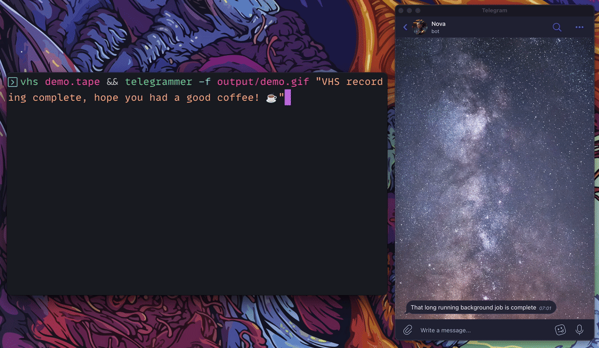

# Telegrammer



Telegrammer is a command-line interface (CLI) tool written in Go that allows you to send messages or documents to a specified user on Telegram, as well as retrieve your user ID for configuration by running in server mode. It uses the Telegram Bot API to send messages and documents.

## Features

- Send text messages to a specified user on Telegram.
- Send documents to a specified user on Telegram.
- Retrieve your user ID for configuration by running in server mode.
- Configurable through environment variables or a configuration file.
- Provides visual feedback on successful message delivery.

## Installation

You can download Telegrammer from the [releases](https://github.com/sixlive/telegrammer/releases) page.

Or install with `go`:

```
go install github.com/sixlive/telegrammer
```

## Usage

To use Telegrammer, you need to have a Telegram bot token and the user ID of the recipient. You can set these through environment variables or in a YAML configuration file. Additionally, you can run Telegrammer in server mode to listen for new messages and find your user ID for configuration.

### Environment Variables

- `TELEGRAMMER_BOT_KEY` - Your Telegram bot token.
- `TELEGRAMMER_USER_ID` - The user ID of the recipient.

### Configuration File

You can also provide a configuration file in YAML format. The file should have the following structure:

yaml bot_key: your_bot_token user_id: recipient_user_id

You can place the configuration file in the following locations:

- `$HOME/.config/telegrammer/config.yaml`
- `./config.yaml` (in the same directory as the Telegrammer binary)

### Command-Line Flags

- `-f, --file` - Path to the file you want to send.
- `--server` - Run in server mode to listen for new messages and find your user ID.

### Examples

Send a text message:

`telegrammer "Hello, world!"`

Send a document:

`telegrammer -f /path/to/document.pdf "Here's the document you requested."`

Find your user ID by running in server mode:

`telegrammer --server`

## Contributing

Contributions to Telegrammer are welcome! Please submit a pull request or create an issue if you have any features you'd like to add or bugs you've found.

## License

Telegrammer is licensed under the MIT License. See [LICENSE](LICENSE) for more information.
